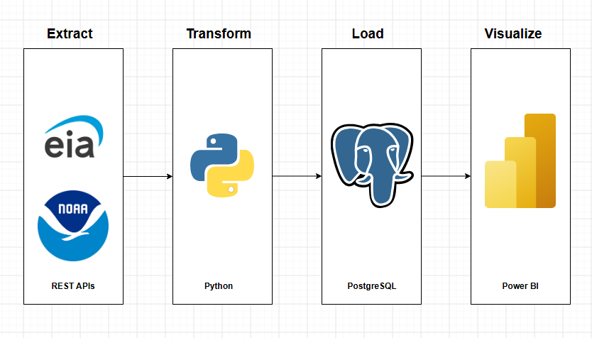
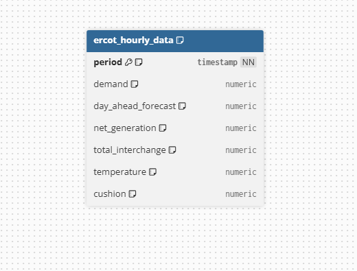

# ERCOT Demand vs. Generation Analysis

## Project Overview

This project examines how temperature affects electricity demand on the Texas power grid (ERCOT), and identifies the point at which rising demand shrinks the grid's generation cushion, the safety margin between how much power is being produced and how much is being used.

Using five years of hourly grid data from the U.S. Energy Information Administration (EIA) and hourly temperature data from NOAA (Houston station), this analysis connects weather conditions to grid reliability risk, with a specific focus on identifying when that safety margin becomes dangerously thin.

## Main Analysis Question

How does temperature affect electricity demand in Texas, and at what point does that increased demand shrink the generation cushion enough to represent a real reliability risk?

## Why This Matters

Texas operates its own largely self-contained power grid, meaning it has limited ability to import power from neighboring states during periods of extreme demand. Understanding when and why the grid's safety margin gets thin, and whether that pattern is predictable based on temperature, is directly useful for reserve capacity planning, maintenance scheduling, and reliability risk management.
---
# Technology Workflow

---
# Data Schema

---

