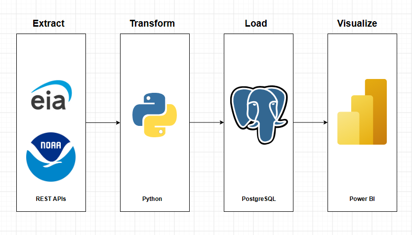
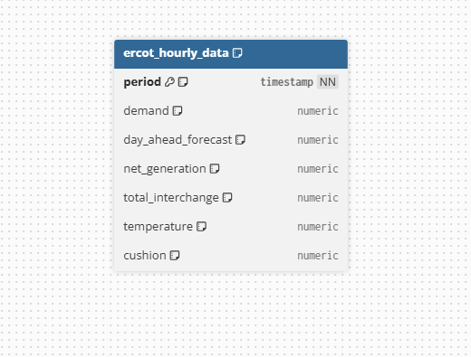
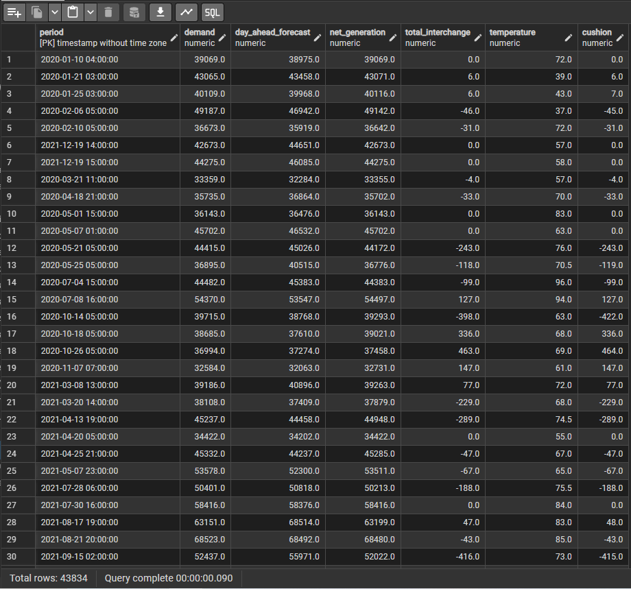
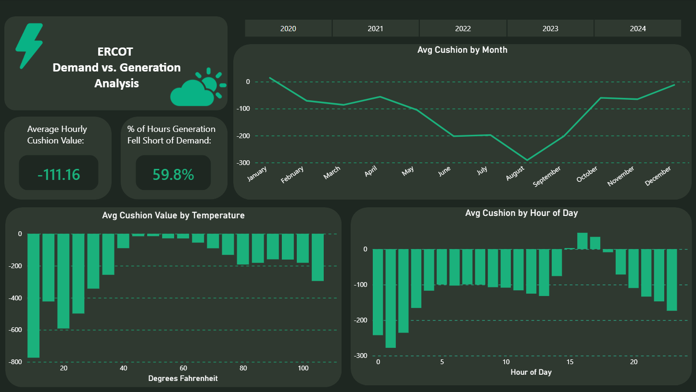
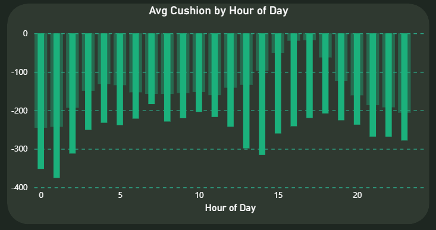
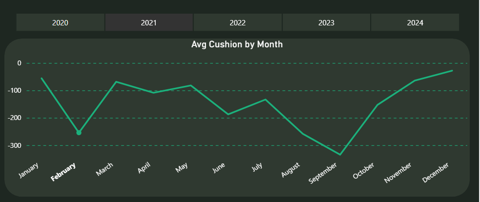
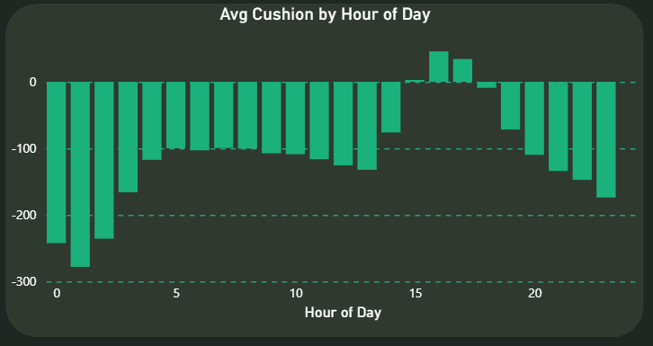
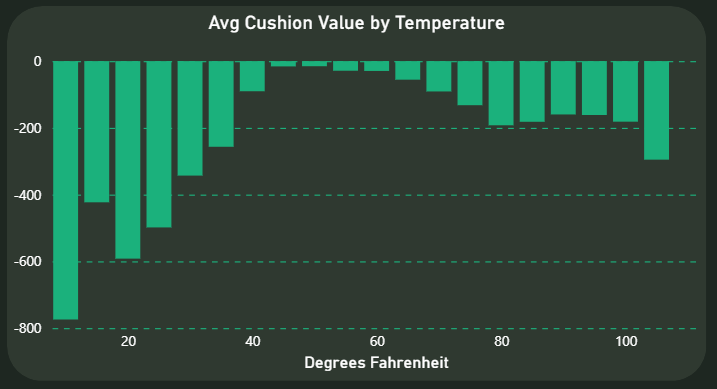
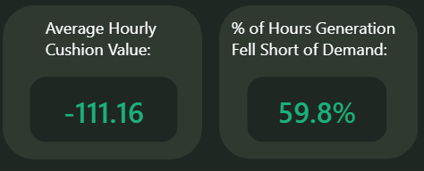

# ERCOT Demand vs. Generation Analysis

## Project Overview

This project examines how temperature affects electricity demand on the Texas power grid (ERCOT), and identifies the point at which rising demand shrinks the grid's generation cushion, the safety margin between how much power is being produced and how much is being used.

Using five years of hourly grid data from the U.S. Energy Information Administration (EIA) and hourly temperature data from NOAA (Houston station), this analysis connects weather conditions to grid reliability risk, with a specific focus on identifying when that safety margin becomes dangerously thin.

## Main Analysis Question

How does temperature affect electricity demand in Texas, and at what point does that increased demand shrink the generation cushion enough to represent a real reliability risk?

## Why This Matters

Texas operates its own largely self-contained power grid, meaning it has limited ability to import power from neighboring states during periods of extreme demand. Understanding when and why the grid's safety margin gets thin, and whether that pattern is predictable based on temperature, is directly useful for reserve capacity planning, maintenance scheduling, and reliability risk management.

# Technology Workflow

* REST API: [EIA](https://www.eia.gov/opendata/) was used to source hourly electricity demand and generation data for ERCOT, and [NOAA](https://www.ncei.noaa.gov/access/services/data/v1) was used to source hourly temperature data for Houston.
* Extract/Transform: Python, using `requests` and `pandas`, handled pulling data from both APIs, reshaping the electricity data into a usable format, and merging both sources together on their shared hourly timestamp.
* Storage: PostgreSQL was used for data storage, structured as a single flat table rather than a star schema, since this dataset is a single time series with no natural dimensions to separate out.
* Analysis: SQL was used to check data quality and calculate the generation cushion (net generation minus demand), the core metric used to measure grid reliability risk.
* Visualization: Power BI was used to build an interactive dashboard displaying the relationship between temperature, demand, and grid cushion.

# Data Schema

* The diagram above shows the database's schema design, which uses a single flat table rather than a star schema. This approach was chosen because the underlying data is fundamentally a single hourly time series (electricity demand, generation, and temperature) with no repeating categorical fields like organization, location, or job category that would benefit from being broken out into separate dimension tables. Splitting this data into multiple tables would add unnecessary complexity without any real analytical benefit, so a single table was used instead.

***

# Data dictionary

| Column Name | Data Type | Description |
|---|---|---|
| `period` | timestamp | The hour the reading corresponds to (UTC). Serves as the primary key. |
| `demand` | numeric | Actual electricity demand for ERCOT during that hour, in megawatthours. |
| `day_ahead_forecast` | numeric | EIA's day-ahead forecasted demand for that hour, in megawatthours. |
| `net_generation` | numeric | Actual electricity generated for ERCOT during that hour, in megawatthours. |
| `total_interchange` | numeric | Net power exchanged with neighboring grids during that hour, in megawatthours. Negative values indicate net import, positive values indicate net export. |
| `temperature` | numeric | Hourly temperature reading from the Houston Bush Intercontinental Airport (IAH) station, in degrees Fahrenheit. |
| `cushion` | numeric | Calculated as `net_generation` minus `demand`. Represents the grid's reserve margin for that hour; lower or negative values indicate elevated reliability risk. |

***

# Data Extraction and Transformation

This project combines two independent data sources, hourly electricity data from EIA and hourly weather data from NOAA, to explore the relationship between temperature and grid demand. Getting from two separate API responses to a single merged, analysis-ready table required several steps.

## Exploring the Data

Before writing any pull scripts, I examined the structure of both APIs' responses to understand what I was working with and to identify a shared field the two sources could eventually be joined on. Since both datasets are recorded hourly, the timestamp was the natural join key.

This exploration also surfaced an important structural issue: the EIA data came back in long format, with each hour split across four separate rows (one per metric: demand, forecast, generation, and interchange). This needed to be reshaped before the two datasets could be merged.

## Extraction

The [`scripts/`](scripts/) folder contains the Python scripts used to pull and transform both datasets:

- [`scripts/ercot.py`](scripts/ercot.py) pulls five years of hourly electricity data from the EIA API for ERCOT (the Texas grid operator)
- [`scripts/noaa.py`](scripts/noaa.py) pulls five years of hourly temperature data from NOAA for the Houston (IAH) weather station

Both scripts handle pagination, since neither API returns more than a few thousand rows per request, and a multi-year hourly pull far exceeds that limit.

## Transformation

Once both datasets were pulled, a few transformation steps prepared them for merging:

- [`scripts/pivot.py`](scripts/pivot.py) reshaped the EIA data from long format into wide format, turning each hour's four separate rows into a single row with four columns
- [`scripts/join.py`](scripts/join.py) merged the reshaped EIA data with the cleaned NOAA data on their shared hourly timestamp, producing one combined table with both electricity and weather data for each hour

## Loading and Cleaning

Once the merged dataset was ready, it was loaded into a PostgreSQL database for structured storage and analysis.

- The final merged CSV was imported into a single table, `ercot_hourly_data`, matching the column structure produced by the transformation step
- Column names were cleaned up during import (for example, removing spaces from fields like "Net generation") to make them easier to reference in SQL queries
- A duplicate timestamp column left over from the merge was identified and removed, keeping `period` as the single primary key for the table

With the table structured correctly, the data was then checked and cleaned using SQL:

- Checked for impossible values, such as negative demand or negative generation, none were found
- Checked for duplicate timestamps, confirming each hour appeared exactly once
- Checked for missing values across all columns, a small number of rows (9) were missing a `total_interchange` value and were removed, since this represented a negligible fraction of the dataset
- Added a `cushion` column, calculated as (`net_generation - demand`), to measure the grid's reserve margin for each hour

All SQL used for loading, cleaning, and validation can be found within [`sql/prep.sql`](sql/prep.sql).

This cleaned, structured table became the foundation for all further analysis, including the SQL views and DAX measures used in the final dashboard.

***

# Data Analysis

Once the data was cleaned and loaded, the next step was figuring out what the numbers actually meant and whether they answered the original question: does temperature affect how much electricity Texas uses, and does that ever push the grid close to running out of extra power?

To answer this, a new column called `cushion` was created. This is just the amount of electricity generated minus the amount of electricity actually used, for every single hour. A positive cushion means there was extra power to spare that hour. A negative cushion means generation came in under what was actually needed, the closer to a big negative number, the more strain the grid was under.

From there, a few different angles were explored to find real patterns in the data:

- **Month-by-month trend:** cushion was averaged by month across all five years, to see which periods of time were generally higher-risk, and to make it easy to spot and zoom into specific events, like the February 2021 winter storm
- **Hour-of-day pattern:** cushion was also averaged by hour of the day, to check whether certain times, like overnight hours, are consistently riskier than others, regardless of season
- **Temperature vs. cushion:** hours were grouped into 5-degree temperature ranges, then averaged, to see whether cushion tends to shrink when it gets very hot or very cold outside

The goal of all of this wasn't just to make charts, it was to find a specific, usable takeaway: is there a clear range of temperatures where the grid is safest, and a range where it starts getting genuinely risky? And if so, that's the kind of information a grid operator could actually use to plan ahead, for example, making sure extra backup power is ready before a heat wave or cold snap hits, instead of finding out too late.

All SQL queries used for this analysis can be found within [`sql/analysis.sql`](sql/analysis.sql).

***

# Findings and Dashboard Overview

## Month vs. Cushion

With no filter applied, this chart shows a high-level, five-year average, one cushion value per month, combining data from 2020 through 2024. From this view, July stands out as the single worst month on average, the month where demand consistently exceeded generation by the widest margin across all five years.

Looking at the hour-of-day chart alongside it, also unfiltered, a separate pattern emerges: across all five years, hours 0 through 5 and 20 through 23 consistently show the grid's tightest margins, generation falling short of demand most often overnight and in the late evening.

Both charts can be drilled down further. Selecting a specific year filters the monthly view to just that year, and clicking a specific month filters the hourly view down to that month alone, making it possible to see whether a particular month is driving the overall average up or down, rather than relying on the five-year blend alone.

One interesting contrast worth calling out: July shows the worst average cushion by month, yet the temperature-vs-cushion chart shows the opposite pattern, cushion is actually worse in **cold** temperatures than hot ones. This isn't a contradiction, it's a reminder that "worst month on average" and "worst temperature range" are measuring two different things. July's poor showing is likely driven by sustained high demand from consistent summer heat across the *entire* month, while the far more extreme cold-weather readings are concentrated in a small number of specific hours, mainly during the February 2021 freeze, which pull the temperature-based average down sharply for that narrow range, without dominating a full month's average the way July's heat does.

For example, here is the same hour-of-day chart drilled down specifically to February 2021, compared against the five-year average shown above:

And the monthly view for that same year, with February highlighted:

Winter Storm Uri, the historic Texas freeze, struck over roughly six days in mid-February 2021. Even though it affected only a fraction of the month, it was severe enough that February 2021 alone comes close to matching an entire month like July for average cushion, despite July's poor showing being driven by sustained heat across all 31 days, not a single short event. This highlights just how extreme the storm's impact was, a handful of days pulled a whole month's average down to nearly match a month that struggled for its full duration.

## Cushion by Hour of Day

Going back to the high-level, five-year overview, a clear daily pattern emerges: generation typically keeps pace with, or even exceeds, demand during the afternoon hours, roughly the early-to-mid afternoon window, which lines up closely with peak solar generation output. Outside of that window, particularly overnight and into the early morning, demand consistently exceeds generation, with the tightest margins showing up between midnight and 5 AM, and again in the late evening hours.

This suggests that time of day, not just temperature, plays an independent role in how much reserve margin the grid has at any given moment. The consistent dip overnight is likely tied to the complete absence of solar generation during those hours, combined with demand patterns that don't fall off enough to offset it.

## Cushion by Temperature

This chart groups every hour across all five years into 5-degree temperature ranges and shows the average cushion for each. The pattern is clear: cushion stays close to zero, the grid's healthiest range, somewhere between roughly 45°F and 70°F. Outside that range, in both directions, cushion gets worse, but the effect is far more severe on the cold side. The coldest temperature ranges show average cushion values as low as -774, while the hottest ranges only drop to around -295.

This is the core finding of the project: extreme temperatures, and extreme cold in particular, are strongly associated with the grid's reserve margin shrinking.

## Average Hourly Cushion and Generation Shortfall Rate

Across the full five-year dataset, the average hourly cushion comes out to about -111 megawatthours, a small number relative to typical hourly demand, which generally runs in the tens of thousands of megawatthours. On its own, this suggests the grid usually runs close to balanced.

However, a closer look shows that generation fell short of demand in 59.8% of all hours over the five-year period. In other words, a small negative cushion is actually the more common state, not the exception, it's just small enough in magnitude most of the time that it doesn't represent a real reliability risk. This is a normal part of grid operation, driven by things like transmission losses and minor timing differences between how demand and generation are measured, rather than a sign of chronic shortage.

What changes during events like the February 2021 freeze isn't that shortfalls start happening, they're already common, it's how severe those shortfalls become.

# Final Recommendations

**Prepare additional reserve capacity ahead of forecasted temperature extremes.** As expected, extreme temperatures, both hot and cold, reduce the grid's reserve margin, with cold weather having a notably more severe effect than heat. Preparing additional reserve capacity ahead of forecasted temperature extremes, particularly cold snaps, is a reasonable and fairly intuitive response to this finding.

**Focus on overnight hours when forecasting energy generation.** Regardless of season or temperature, cushion is consistently at its tightest between midnight and 5 AM, and again in the late evening, a pattern that holds true across all five years, not just during extreme weather events. This suggests the grid has a harder time keeping generation ahead of demand specifically during these hours, likely tied to the complete absence of solar generation overnight, combined with demand that doesn't fall off enough to compensate. Unlike seasonal or weather-driven risk, which is relatively easy to anticipate and plan around, this overnight pattern is a structural, recurring gap that shows up regardless of conditions, suggesting it may be under-accounted for in current planning, and represents a more actionable, specific opportunity for improvement than weather preparedness alone.

**Use short-duration extreme events as their own planning category, separate from seasonal averages.** February 2021 showed that a brief, severe event can rival the cumulative strain of an entire month of sustained heat, like July's. Extreme-event readiness should be planned independently from general seasonal capacity planning, since a short freeze can concentrate a month's worth of risk into just a few days.

**Calibrate monitoring around severity, not just frequency.** Generation fell short of demand in roughly 60% of all hours across the five-year dataset, meaning a small negative cushion is the normal state, not a warning sign on its own. Alerting and planning should focus on how severe a shortfall is relative to typical conditions, rather than treating any instance of negative cushion as abnormal.